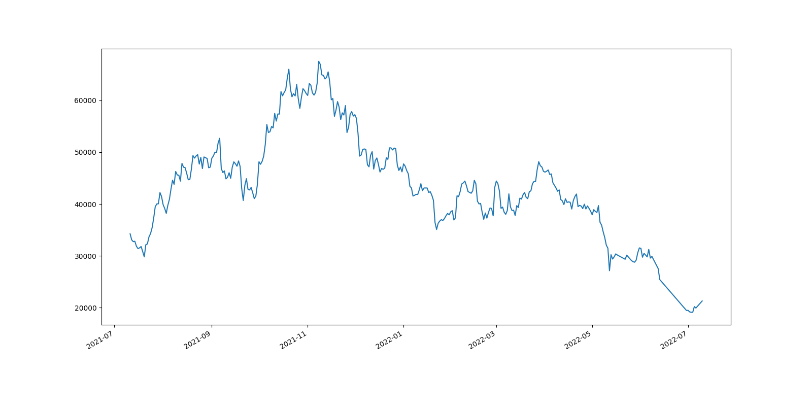
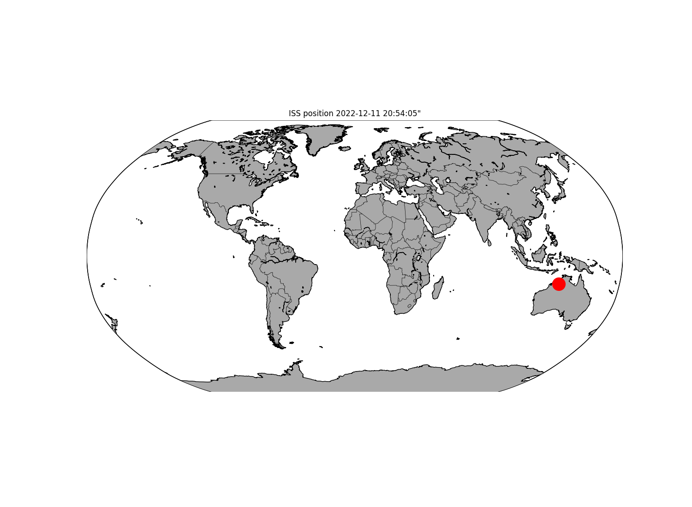

# CS50P Final Project
# => Test different APIs


### Video Demo:
  https://github.com/chris-FR-GitHub/HarvardX-CS50P/raw/3790bc4089f770a5cfb78a8ef64e42700d53aafc/Final%20Project/CS50P%20%E2%80%93%20Final%20Project.mp4

<hr />

### Description:

### GOAL :
Test and use different web APIs (free API / JSON format)

### APIs:
- CoinDesk Bitcoin Price Index: current Bitcoint price and historical data
    - Current price : https://api.coindesk.com/v1/bpi/currentprice.json
    - Historical data : https://api.coindesk.com/v1/bpi/historical/close.json
- ISS (International Space Station) : current position
    - https://api.wheretheiss.at/v1/satellites/25544

### Program Usage:
```
project.py -a <api: COINDESK* or ISS> -t <COINDESK: TODAY* or HISTO or GRAPH>
(* : default)
```

<hr />

### CoinDESK – Current Price:

#### APIs:
COINDESK => current price
https://api.coindesk.com/v1/bpi/currentprice.json

#### Program arguments:
python project.py -a COINDESK -t TODAY

#### Result:
Call the API and display the current Bitcoin price in USD

````
API: COINDESK
TYPE: TODAY

CoinDesk Bitcoin Price Index (USD)
╒═════════════════════╤════════════════╕
│ Date (ISO)          │   Value in USD │
╞═════════════════════╪════════════════╡
│ 2022-12-11 20:40:00 │       17121.15 │
╘═════════════════════╧════════════════╛

````

<hr />

### CoinDESK – Historical Date # 1:

#### APIs:
COINDESK => historical data (5 last months non available)<br />
https://api.coindesk.com/v1/bpi/historical/close.json

#### Program arguments:
python project.py -a COINDESK -t HISTO

#### Result:
Call the API (1 full year) and display simple Bitcoin price statistics (min, max, avg, median)

````
API: COINDESK
TYPE: HISTO

CoinDesk Bitcoin Price Index (USD) - from 2021-07-11 to 2022-07-10
╒══════════════╤════════════════╤════════════════╕
│ Type         │ Date (ISO)     │   Value in USD │
╞══════════════╪════════════════╪════════════════╡
│ First record │ 2021-07-11     │       34254.00 │
├──────────────┼────────────────┼────────────────┤
│ Last record  │ 2022-07-10     │       21296.01 │
├──────────────┼────────────────┼────────────────┤
│ Min value    │ ['2022-07-03'] │       19115.52 │
├──────────────┼────────────────┼────────────────┤
│ Max value    │ ['2021-11-08'] │       67544.87 │
├──────────────┼────────────────┼────────────────┤
│ Average      │ -              │       44250.96 │
├──────────────┼────────────────┼────────────────┤
│ Median       │ -              │       43315.10 │
╘══════════════╧════════════════╧════════════════╛
````


<hr />

### CoinDESK – Historical Date # 2:

#### APIs:
COINDESK => historical data (5 last months non available)<br />
https://api.coindesk.com/v1/bpi/historical/close.json

#### Program arguments:
python project.py -a COINDESK -t GRAPH

#### Result:
Call the API (1 full year) and generate a simple line chart




<hr />

### ISS – current position:

#### APIs:
wheretheiss => current position<br />
https://api.wheretheiss.at/v1/satellites/25544

#### Program arguments:
python project.py -a ISS

#### Result:
Call the API, display the result as a table and generate a map

````
API: ISS
TYPE: TODAY

2022-12-11 17:42:02
╒══════════════════╤═════════════════════╕
│ Name             │ Value               │
╞══════════════════╪═════════════════════╡
│ name             │ iss                 │
├──────────────────┼─────────────────────┤
│ id               │ 25544               │
├──────────────────┼─────────────────────┤
│ latitude         │ -24.978899036592    │
├──────────────────┼─────────────────────┤
│ longitude        │ 121.51958847861     │
├──────────────────┼─────────────────────┤
│ altitude         │ 426.98718654488     │
├──────────────────┼─────────────────────┤
│ velocity         │ 27553.382319283     │
├──────────────────┼─────────────────────┤
│ visibility       │ daylight            │
├──────────────────┼─────────────────────┤
│ footprint        │ 4542.8416642065     │
├──────────────────┼─────────────────────┤
│ timestamp        │ 1670791872          │
├──────────────────┼─────────────────────┤
│ daynum           │ 2459925.3688889     │
├──────────────────┼─────────────────────┤
│ solar_lat        │ -23.046021413585    │
├──────────────────┼─────────────────────┤
│ solar_lon        │ 225.55245303293     │
├──────────────────┼─────────────────────┤
│ units            │ kilometers          │
├──────────────────┼─────────────────────┤
│ timestamp as Day │ 2022-12-11 20:51:12 │
╘══════════════════╧═════════════════════╛
````




